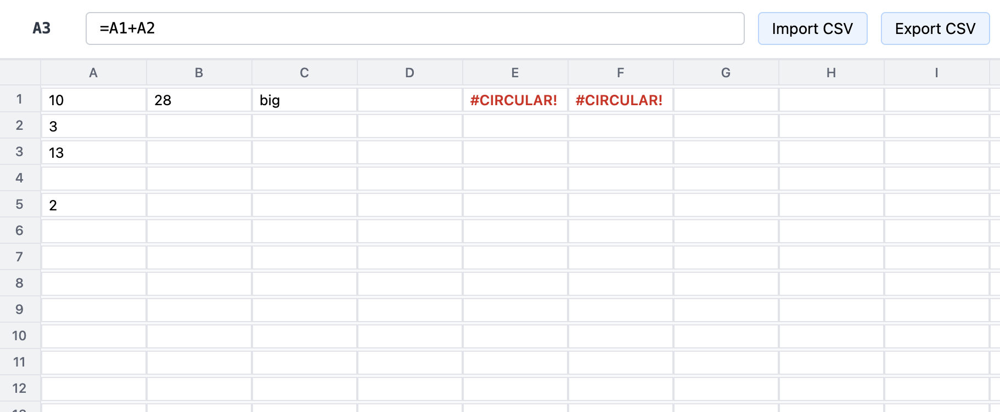
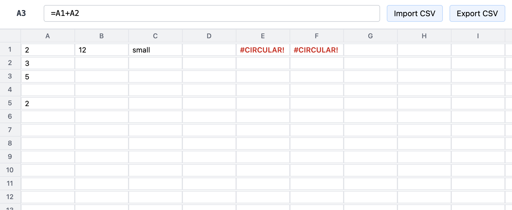
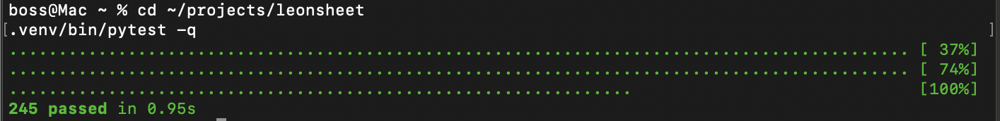

# leonsheet

A working spreadsheet, vibe-coded in three hours.



Source for the portfolio piece described in [Outwork #10](https://wpoutwork.substack.com/p/what-3-hours-of-cloning-excel-with) ("What 3 hours of cloning Excel with Claude Cowork and Code taught me about being a new 3 part entity"). Built by Leonard Sibelius — the three-part entity composed of Walt Parkman (40+ years senior-Java engineering judgment), Claude Cowork (long-context planning and orchestration), and Claude Code (CLI execution and git discipline).

---

## What's in v1.0

- **26×100 grid** with a formula bar and selection model
- **Hand-written formula language** — tokenizer (170 lines, 19 token kinds), recursive-descent parser (160 lines), pure-function evaluator (310 lines)
- **Seven functions**: `SUM`, `AVERAGE`, `MIN`, `MAX`, `COUNT`, `IF`, `CONCAT`
- **Cell references and ranges**: `A1`, `AA10`, `A1:A10` — bijective base-26 column letters
- **Dependency graph with Kahn's topological sort** and natural cycle detection (`#CIRCULAR!`)
- **SQLite persistence** with WAL mode — cells and formulas survive server restart
- **CSV import / export** with apostrophe-escape for literal `=`-prefixed strings
- **HTMX UI** — per-cell out-of-band swap on cascade updates, no full-page re-render
- **245 passing tests** — full suite under one second



When A1 changes from `10` to `2`, the dependency graph drives auto-recalculation of every downstream cell: A3 drops from `13` to `5`, B1 drops from `28` to `20`, C1 flips from `big` to `small`. One edit, three downstream updates, no manual recalculation trigger.

---

## The 50-deep cascade is fast

The acceptance criterion: edit a cell with 50 transitive dependents and the round-trip must complete in under 500 milliseconds. Actual measured time on a 2020 MacBook: **one millisecond.** Five hundred times headroom.

---

## Quick start

```bash
git clone https://github.com/LeonardSibelius/leonsheet.git
cd leonsheet
python3 -m venv .venv
.venv/bin/pip install -e ".[dev]"
.venv/bin/uvicorn app.main:app --port 8000
```

Open [localhost:8000](http://localhost:8000) in Chrome.

Run the test suite:

```bash
.venv/bin/pytest -q
```



---

## Architecture

```
app/
  main.py               # FastAPI app, create_app factory, HTMX routes
  db/
    connection.py       # SQLite connection with WAL + foreign_keys pragmas
    schema.sql          # cells, dependencies, meta tables
    store.py            # Store.load + Store.persist_cells
  formula/
    tokenizer.py        # 19 token kinds, greedy cell-ref tokenization
    parser.py           # Recursive descent with comparison operators
    ast_nodes.py        # Frozen-dataclass AST
    evaluator.py        # 7 functions + coercions, fexpr-style IF
    refs.py             # Bijective base-26 column letter conversions
    values.py           # EMPTY, ErrorValue sentinels
  sheet/
    cells.py            # Cell store with public attrs
    graph.py            # Forward/reverse adjacency + Kahn topo sort
    recalc.py           # Recalc orchestration
    sheet.py            # Sheet class, bulk_load, public API
  templates/
    index.html          # Grid + formula bar
    macros.html         # Single source for cell rendering
db/
  schema.sql            # Mirror of app/db/schema.sql for initial provisioning
tests/                  # 245 tests across 10 files
docs/                   # Hero/cascade/tests screenshots
```

**The Sheet class has no I/O.** It's a pure in-memory data structure. Persistence wraps it from outside via `Store`; HTTP wraps it from above via FastAPI. The 245 tests mostly hit the Sheet directly — no fixtures, no mocks, no HTTP — which is why the full suite runs in under one second.

**The evaluator is pure-function with a `lookup(row, col)` callback.** No coupling to the Sheet. Unit-testable in isolation.

**Functions receive raw AST arguments, not pre-evaluated values** (the *fexpr* pattern). This enables correct `IF` short-circuit evaluation — `IF(A1>5, expensive_function(), other)` does not evaluate `expensive_function()` when `A1<=5`, the way every spreadsheet user expects.

**Per-cell HTMX out-of-band swap** on cascade updates. Server returns only the cells that actually changed, each tagged with `hx-swap-oob="true"`. No grid re-render. No flicker.

---

## The bug-prediction discipline

Before the first line of code, we built a 17-bug preflight ledger — bugs we expected from forty years of engineering experience and from architectural reasoning. Each prediction came with a named test written before the implementation. All seventeen guards are in place in v1.0. The ledger is in the [Outwork #11 retrospective](#) when it ships; in the meantime, search the test files for the named tests:

| # | Layer | Test |
|---|---|---|
| 1 | UI focus restoration | manual browser verification |
| 2 | tokenizer greediness | `test_greedy_cell_ref_AA10_is_one_token` |
| 3 | range expansion | `test_range_in_sum_expands_to_cell_values` |
| 4 | empty cell semantics | `test_average_skips_empty_in_denominator`, `test_count_only_numerics` |
| 5 | topological-sort determinism | `test_topo_diamond_with_deterministic_tiebreak` |
| 6 | SQLite WAL | `test_wal_mode_set` |
| 7 | float display precision | `test_float_precision_rounded_for_display` |
| 8 | cycle detection at all scales | `test_topo_self_loop`, `test_topo_100_cell_cycle` |
| 9 | fexpr-style IF short-circuit | `test_if_short_circuits_unchosen_branch` |
| 10 | unary minus | `test_double_unary_minus`, `test_unary_minus_in_expression` |
| 11 | multi-char comparison ops | `test_comparison_operator` |
| 12 | dep edge cleanup on formula replace | `test_formula_replacement_drops_old_dependencies` |
| 13 | self-referencing range | `test_self_referencing_range_marked_circular` |
| 14 | overflow / NaN sentinels | `test_evaluator_results_are_json_safe`, `test_arithmetic_overflow_returns_num_error` |
| 15 | base-26 column letter round-trip | `test_round_trip_first_1000_columns` + 13 corner cases |
| 16 | stale-response detection | deferred to v1.1 (single-user + threading.Lock makes the race window zero) |
| 17 | (row, col) ints internally | every layer passes a value through |

---

## Roadmap

| Version | Scope | Status |
|---|---|---|
| **v1.0** | Core grid + formulas + dependency graph + persistence | ✅ Shipped May 18, 2026 |
| **v1.1** | Per-session multi-tenancy → hosted demo at leonsheet.leonardsibelius.com | Planned |
| **v1.2** | Charts via Chart.js | Backlog |
| **v1.3** | Selection, copy/paste, range operations | Backlog |
| **v2.0** | Real-time collaboration via WebSocket | Backlog |
| **v2.1** | Power functions: VLOOKUP, COUNTIF, date, text | Backlog |
| **v3.0** | Pivot tables | Backlog |

Backlog tracked in Linear under the SHEET team.

---

## Stack

Python 3.12 · FastAPI · HTMX + Tailwind via CDN (no build step) · SQLite · uvicorn · pytest

No webpack, no bundler, no transpiler. The HTML in `app/templates/` is served as-is and HTMX picks it up on the client. The Tailwind classes resolve against a CDN-loaded stylesheet.

---

## License

MIT.

---

## Related

- **[Outwork #10](https://wpoutwork.substack.com/p/what-3-hours-of-cloning-excel-with)** — the positioning essay for the build (three-part entity framing)
- **Outwork #11** — engineering retrospective (publishing imminent; will link here when live)
- **[leonardsibelius.com](https://leonardsibelius.com)** — engineering portfolio (Leonard Sibelius is what happens when Walt + Cowork + Code work as one)
- **[github.com/LeonardSibelius/orders-pipeline](https://github.com/LeonardSibelius/orders-pipeline)** — companion Java/Camel portfolio piece (federal-contracting profile)

---

## Hire the entity

Available for senior contract engineering and full-time roles. Email: wpneural@gmail.com · [outpostintel.com/walt-parkman](https://outpostintel.com/walt-parkman) · [github.com/LeonardSibelius](https://github.com/LeonardSibelius)
